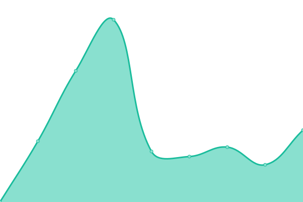

# [📈 Live Status](https://demo.upptime.js.org): <!--live status--> **🟩 All systems operational**

This repository contains the open-source uptime monitor and status page for [DS Media Group](https://project.dsgroupmedia.com), powered by [Upptime](https://github.com/upptime/upptime).

With [Upptime](https://upptime.js.org), you can get your own unlimited and free uptime monitor and status page, powered entirely by a GitHub repository. We use [Issues](https://github.com/dsmgid/status/issues) as incident reports, [Actions](https://github.com/dsmgid/status/actions) as uptime monitors, and [Pages](https://demo.upptime.js.org) for the status page.

<!--start: status pages-->
<!-- This summary is generated by Upptime (https://github.com/upptime/upptime) -->
<!-- Do not edit this manually, your changes will be overwritten -->

| URL                                                   | Status | History                                                                                                              | Response Time                                                                                  | Uptime                                                                                                                                                                                                                                 |
| ----------------------------------------------------- | ------ | -------------------------------------------------------------------------------------------------------------------- | ---------------------------------------------------------------------------------------------- | -------------------------------------------------------------------------------------------------------------------------------------------------------------------------------------------------------------------------------------- |
| [DSMG Home](https://dsgroupmedia.com)                 | 🟩 Up  | [dsmg-home.yml](https://github.com/dsmgid/status/commits/master/history/dsmg-home.yml)                               |  1140ms                |                                 |
| [DSMG Cloud Home](https://dsmg.cloud)                 | 🟩 Up  | [dsmg-cloud-home.yml](https://github.com/dsmgid/status/commits/master/history/dsmg-cloud-home.yml)                   |  1982ms          |                     |
| [DSMG Cloud Premium Panel](https://member.dsmg.cloud) | 🟩 Up  | [dsmg-cloud-premium-panel.yml](https://github.com/dsmgid/status/commits/master/history/dsmg-cloud-premium-panel.yml) |  2331ms |  |
| [DSMG Cloud Free Panel](https://member.dsmg.my.id)    | 🟩 Up  | [dsmg-cloud-free-panel.yml](https://github.com/dsmgid/status/commits/master/history/dsmg-cloud-free-panel.yml)       |  845ms     |         |

<!--end: status pages-->

[**Visit our status website →**](https://demo.upptime.js.org)

## 📄 License

- Code: [MIT](./LICENSE) © [DS Media Group](https://project.dsgroupmedia.com)
- Data in the `./history` directory: [Open Database License](https://opendatacommons.org/licenses/odbl/1-0/)
