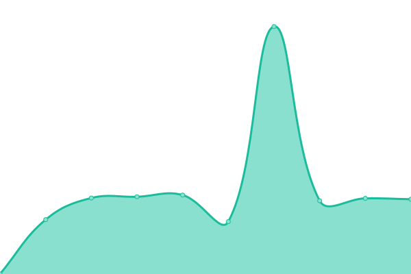

# [📈 Live Status](https://demo.upptime.js.org): <!--live status--> **🟩 All systems operational**

This repository contains the open-source uptime monitor and status page for [DS Media Group](https://project.dsgroupmedia.com), powered by [Upptime](https://github.com/upptime/upptime).

With [Upptime](https://upptime.js.org), you can get your own unlimited and free uptime monitor and status page, powered entirely by a GitHub repository. We use [Issues](https://github.com/dsmgid/status/issues) as incident reports, [Actions](https://github.com/dsmgid/status/actions) as uptime monitors, and [Pages](https://demo.upptime.js.org) for the status page.

<!--start: status pages-->
<!-- This summary is generated by Upptime (https://github.com/upptime/upptime) -->
<!-- Do not edit this manually, your changes will be overwritten -->
<!-- prettier-ignore -->
| URL | Status | History | Response Time | Uptime |
| --- | ------ | ------- | ------------- | ------ |
|  [DSMG Home](https://dsgroupmedia.com) | 🟩 Up | [dsmg-home.yml](https://github.com/dsmgid/status/commits/master/history/dsmg-home.yml) | 

 1302ms
     
 | 

<a href="https://status.dsmg.my.id/history/dsmg-home">99.70%</a>
    

|  [DSMG Cloud Home](https://dsmg.cloud) | 🟩 Up | [dsmg-cloud-home.yml](https://github.com/dsmgid/status/commits/master/history/dsmg-cloud-home.yml) | 

 2230ms
     
 | 

<a href="https://status.dsmg.my.id/history/dsmg-cloud-home">100.00%</a>
    

|  [DSMG Cloud Premium Panel](https://member.dsmg.cloud) | 🟩 Up | [dsmg-cloud-premium-panel.yml](https://github.com/dsmgid/status/commits/master/history/dsmg-cloud-premium-panel.yml) | 

 2299ms
     
 | 

<a href="https://status.dsmg.my.id/history/dsmg-cloud-premium-panel">100.00%</a>
    

|  [DSMG Cloud Free Panel](https://member.dsmg.my.id) | 🟩 Up | [dsmg-cloud-free-panel.yml](https://github.com/dsmgid/status/commits/master/history/dsmg-cloud-free-panel.yml) | 

 2291ms
     
 | 

<a href="https://status.dsmg.my.id/history/dsmg-cloud-free-panel">100.00%</a>
    

<!--end: status pages-->

[**Visit our status website →**](https://demo.upptime.js.org)

## 📄 License

- Code: [MIT](./LICENSE) © [DS Media Group](https://project.dsgroupmedia.com)
- Data in the `./history` directory: [Open Database License](https://opendatacommons.org/licenses/odbl/1-0/)
